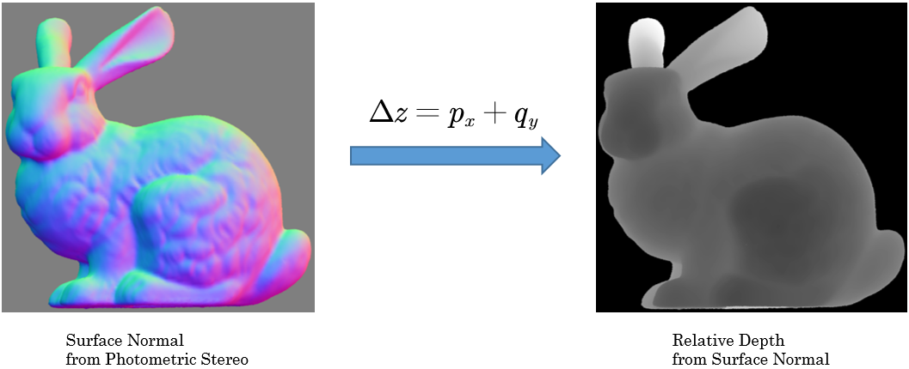
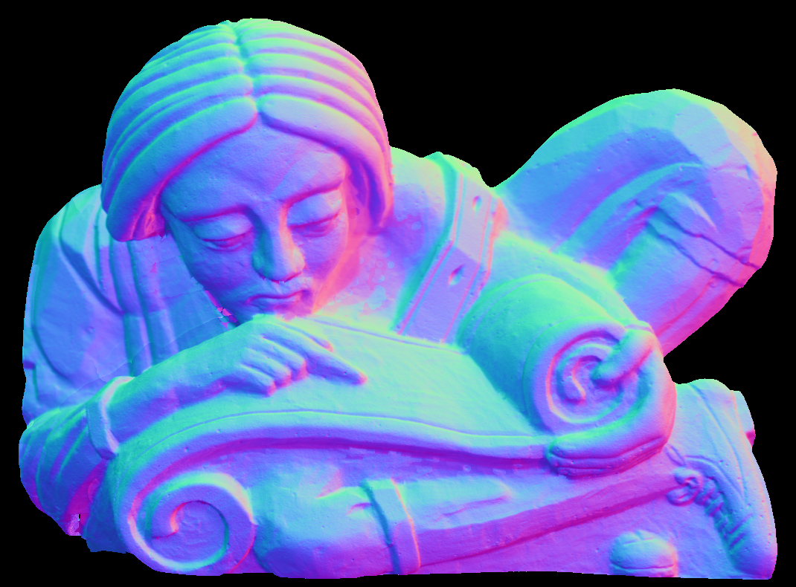
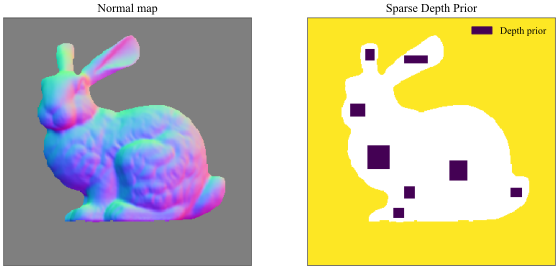
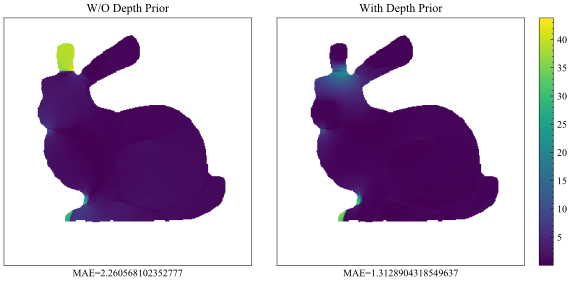

# Discrete normal integration

## What is the Poisson normal integration?
Poisson normal integration is an efficient method to reconstruct surfaces from given normal maps. by solving a Poisson Equation. The Equation comes from solving a functional. We can also add sparse depth prior to refine the result.<br>

Find the depth funciton 
whose gradient best approximates the surface normal (represented
by ). 


Equivalent to minimizing 
:

<p align="center">

</p>

Euler-Lagrange equation for this functional is a Poisson equation:

<p align="center">

</p>

<p align="center">

</p>

## How to use?
Clone the repository and run the main.py:
```
python main.py filename_of_normal_map
```
We have already prepared normal maps for testing. They are put under /data. You can run:
```
python main.py data/scholar.png
```
If you want to add depth prior, you can try:
```
python main.py data/bunny/bunny_normal.npy -d data/bunny/bunny_sparse_depth.npy
```
For more information:
```
python main.py -h
```


- As for the normal maps' formats, we support all the formats which could be read by OpenCV(e.g. png, jpg, bmp) and also npy file in numpy.<br>
**Notice that the background of the normal map should be filled (0, 0, 0)**.<br>
- For adding sparse depth prior, **keep the resolution of depth map same with the normal map**. For unused pixels in depth map, **set them into NaN**. And **use npy format for depth map** to ensure the accuracy<br>


## Result

### Without adding depth prior
Normal map             |  Reconstructed surface 
:-------------------------:|:-------------------------:
  |  

### Adding depth prior
- We use the normal map of standord bunny as input, and add sparse depth prior from different parts.


- Below are the mean absolute error maps of not adding depth prior and adding depth prior. We can see that adding depth prior significantly reduces the depth error.



## Dependencies
- OpenCV-Python
- NumPy
- SciPy
- scikit-learn
